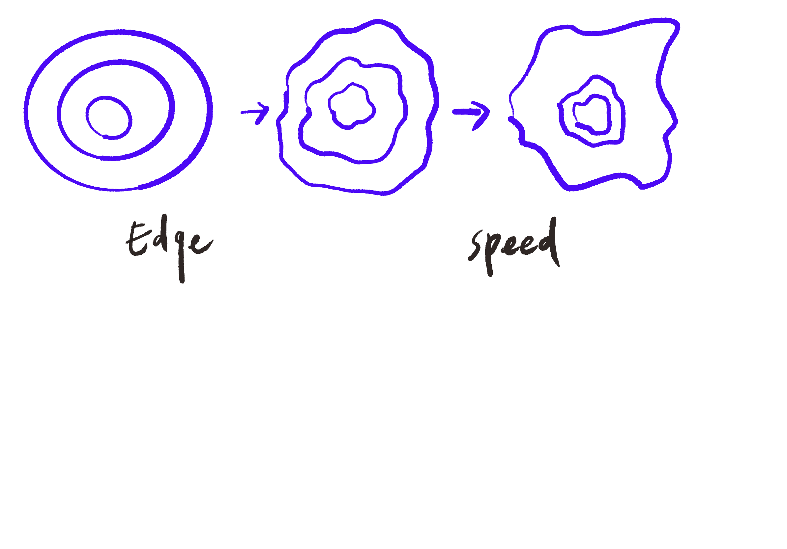
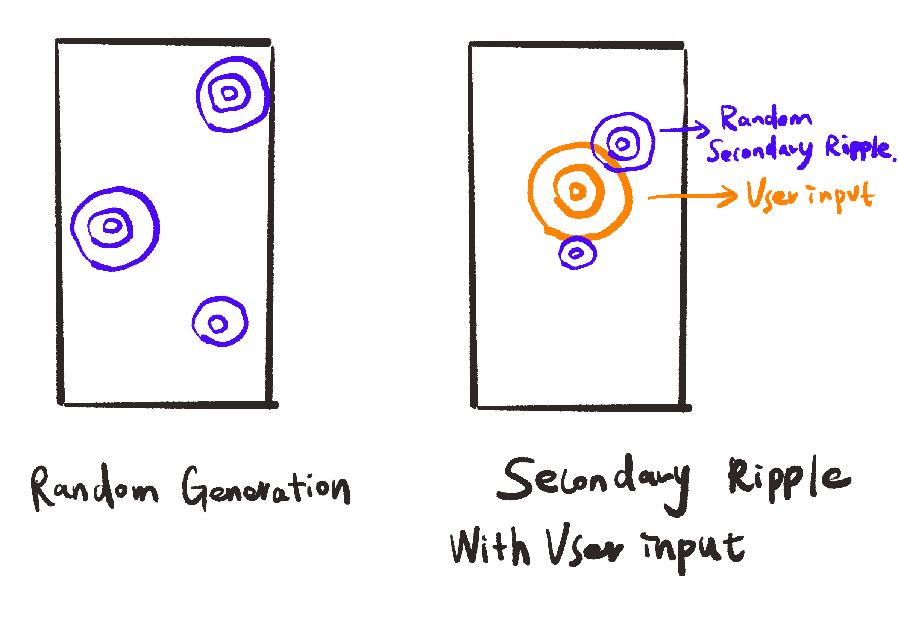

# -Somwrita---Final-Project-Team---1
[Somwrita] - Final Project Team - 1
# Quiz 9: Project Pitch - Team Somwrita

## Part 1: Project Direction

*   **Project Path:** We have chosen to **create an original piece**.
*   **Vision and Inspiration:** Our vision is to develop an interactive installation titled **"Liquid Resonance."** Inspired by the natural physics of **water ripples**, we aim to explore how individual actions create collective impact through wave propagation. We draw inspiration from the way ripples expand and decay, symbolizing human connection and the "echo" of our presence in a digital space. Our direction is shaped by meditative interactive art that uses fluid motion to visualize abstract data.

#### Inspiration Sources

---

## Part 2: Mechanics

Our team will implement four distinct mechanics to drive the "Liquid Resonance" experience:

*   **[Ruitong Zhou] - User Input**
    *   **Description:** This mechanic captures mouse clicks or touch events to define the $(x, y)$ coordinates for new ripple instances. Each click acts as a "drop" in the water, triggering the radial expansion of a `Ripple` object.
    *   **Connection:** It provides the primary interactive layer, allowing users to directly influence the visual outcome of the piece.
    *   **Reference:** [p5.js Mouse Interaction](https://p5js.org/reference/p5/mouseClicked/)

*   **[Shan Jin] - Audio**
    *   **Description:** Using real-time audio input to generate ripple patterns. Amplitude (volume) controls ripple size and intensity, while frequency content affects spatial placement: low frequencies appear near the center and higher frequencies toward the edges. Ripples expand, overlap, and gradually fade, creating a continuous visual flow.
    *   **Connection:** Users interact through voice or music, directly shaping the visuals in real time. This creates an intuitive feedback loop between sound and image. The expanding circular forms reflect water ripple diffusion, translating the original inspiration into an interactive, time-based generative experience.

*   **[Huginn Xing] - Perlin Noise and Randomness**
    *   **Description:** 1.Ripple edge deformation - Perlin noise distorts the edge of each of each ripple, create irregular forms that more like real water movement. 2.Ripple speed variation - Random numbers make speed variable, make motion more alive.
 
  
   * 3.Random ripple generation - Instead of just user input to generate ripples, they will show up as random sizes and positions based on time-based. 4.Secondary ripples - User-input- generated ripples will creates chain reactions, secondary ripples will appear belong main ripples.

 *   **Connection:** It enhances the visual "depth" and realism, making the canva more real and alive.

*   **[Member 4 Name] - Time-based**
    *   **Description:** This mechanic utilizes the `frameCount` and internal timers to manage the lifecycle of each ripple. As time progresses, the ripple’s radius increases while its `alpha` (transparency) value decreases.
    *   **Connection:** This simulates the natural energy loss (amplitude decay) of a wave, ensuring the canvas remains balanced and meditative.

---

## Part 3: Putting It Together

The mechanics will converge on a shared p5.js canvas where **User Input** and **Audio** serve as the primary triggers for creating ripple objects. **Perlin Noise** will then distort these objects in real-time to add texture, while the **Time-based** decay system ensures a constant, flowing turnover of visuals. Conceptually, the project is unified by the theme of "impact and connection," using code to translate physical presence into a coherent, liquid visual language.
